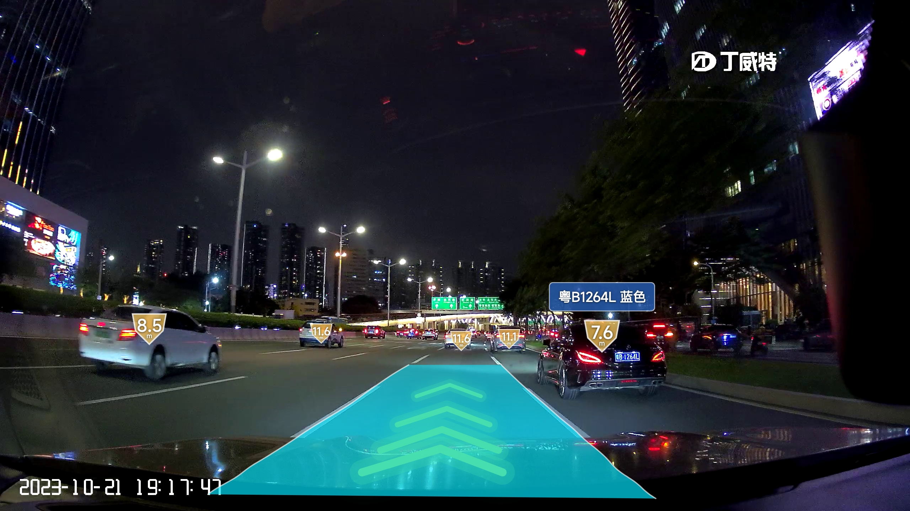
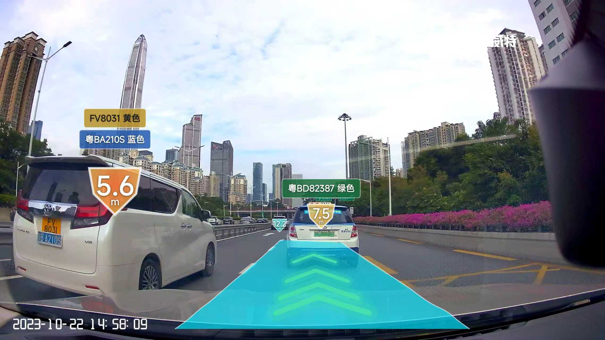
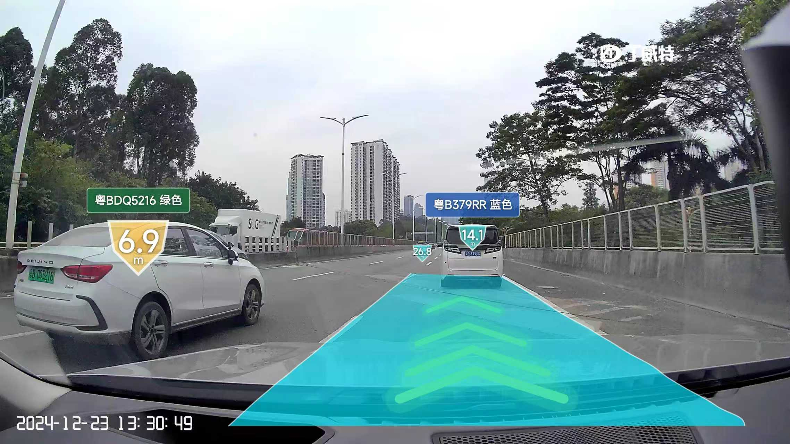
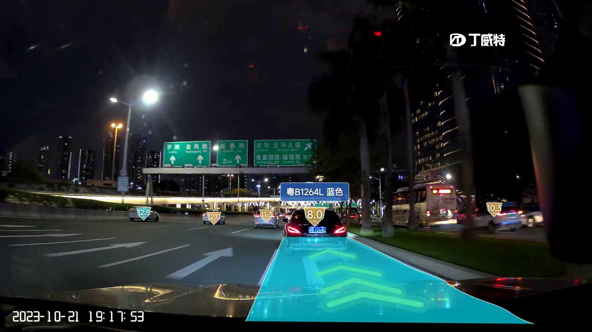

简体中文 | [English](./README_en.md)

如果觉得有用，不妨给个Star⭐️🌟支持一下吧~ 谢谢！

# Acknowledgments & Contact
### 1.WeChat ID: cbp931126
1. 加入讨论群(备注：PlateAlgorithm),大佬多多多卷卷卷；
2. 加微信可以获得整理好的开源和部分私有车牌检测和识别数据(数据需要30元费用)；

# Web Test
大陆车牌识别、港澳车牌识别、台湾车牌识别在线体验:http://zhoujiayao.com:8200/

## 特性
1. 支持车牌识别+车牌颜色+车辆距离+车道线识别
2. 支持Linux、Win、Centos、Ubuntu、统信UOS、麒麟系统(Kylin)下CPU、GPU部署，支持定制化开发
3. 支持C/C++，python，C#、Java等语言调用
4. 支持Android、ios、uniapp部署，可获取商用测试demo(微信ID: cbp931126)
5. 支持瑞芯微rv1106/rv1106/rk3588/rk3568/rk3576等侧端部署，可获取商用测试demo(微信ID: cbp931126)
6. 支持海思系列侧端部署:SS928/Hi3403/Hi3519DV500/Hi3516DV500/Hi3516DV300/Hi3516CV610等，获取商用测试demo(微信ID: cbp931126)
7. 支持算能BM1684系列侧端部署
8. 支持爱芯系列侧端部署:

## Android 构建 (CI)

本仓库将原 C++/TensorRT 实现的 `PlateDetectionRecognition` 移植到 **NCNN** 推理引擎，并对接进 `hyperlpr3-android-sdk`。所有编译、模型转换、APK 打包均通过 GitHub Actions 完成，**无需本地编译**。

### 工作流

| 文件 | 作用 |
| ---- | ---- |
| `.github/workflows/build-so.yml` | 编译 `libhyperlpr3.so` (arm64-v8a / armeabi-v7a) 并导出为工件 |
| `.github/workflows/build-apk.yml` | 完整构建 AAR + APK (Demo 工程) |
| `scripts/build_ncnn_android.sh` | NCNN Android 源码编译脚本 |
| `scripts/convert_onnx_to_ncnn.sh` | `yolov7plate.onnx` & `plate_recognition_color.onnx` → NCNN `.param`/`.bin` |
| `scripts/build_hyperlpr3_so.sh` | 独立 NDK 构建 `libhyperlpr3.so` (供 build-so 使用) |
| `PlateDetectionRecognition/src/ncnn/` | NCNN 实现的检测器、识别器、算法整合 |
| `PlateDetectionRecognition/src/ncnn/jni/jni_bridge.cpp` | JNI 桥接层，对应 Java `com.hyperai.hyperlpr3.core.HyperLPRCore` |
| `hyperlpr3-android-sdk-master/hyperlpr3/src/main/cpp/CMakeLists.txt` | Android library 模块的 CMake 入口 (Gradle externalNativeBuild 调用) |

### 触发方式

- **手动触发**（推荐）：在 GitHub Actions 页面选择 `build-so` 或 `build-apk`，点击 `Run workflow`。两个工作流均设置为仅手动触发，push 不会自动运行。
- `build-apk` 完成后可在 Artifacts 区域下载：
  - `hyperlpr3-apk` — 可直接安装的 APK
  - `hyperlpr3-aar` — 集成进其它 Android 工程的 AAR
  - `plate-ncnn-models` — 转换后的 NCNN 模型文件

### 关键设计

- **推理引擎**：原项目使用 TensorRT + CUDA (仅 NVIDIA GPU)，无法在 Android 上运行。改用 **NCNN** (Tencent 开源) 做纯 CPU 推理，体积小、零依赖、支持 `arm64-v8a` / `armeabi-v7a`。
- **JVM 接口兼容**：Java 端 `HyperLPRCore` 的 `native` 方法签名保持不变；JNI 桥接层把 Java 调用映射到 C++ `Initialize/PlateRecognition_yolov7/Release`。使用方代码无需改动。
- **资源目录**：`assets/r2_mobile` → `assets/plate_ncnn`，由 `SDKConfig.packDirName` 统一管理。
- **模型参数**：`HyperLPRParameter` 默认值已根据 NCNN 性能特征调整 (`threads=4`, `boxConfThreshold=0.3f` 等)。


## 识别效果

### 车道线+车距+车牌识别效果
 
 

### 韩国车牌识别效果
 
 

### 台湾车牌识别效果
 
 

### 港澳车牌识别效果
 
 


### 大陆车牌识别效果
 
 
 
 
 
 

# PlateAlgorithm
## **车牌识别算法，支持12种中文车牌类型**
**1.单行蓝牌**
**2.单行黄牌**
**3.新能源车牌**
**4.白色警用车牌**
**5 教练车牌**
**6 武警车牌**
**7 双层黄牌**
**8 双层武警**
**9 使馆车牌**
**10 港澳牌车**
**11 双层农用车牌**
**12 民航车牌**

## 说明
1. 车牌检测(yolov5plate,yolov7plate,yolov8playe),车牌校正，车牌识别，车牌检测识别;
   
   | 文件夹 | State    |  说明   |
   |:----------|:----------|:----------|
   |PLateDetection_yolov5                 |Done|           yolov5 车牌检测              |
   |PLateDetection_yolov7 				      |Done|           yolov7 车牌检测              |
   |PLateDetection_yolov8 				      |Doing|          yolov8 车牌检测              |
   |PlateRecognition 				         |Done|           车牌识别                     |
   |PlateDetectionRecognition 				|Done|           车牌检测->车牌校正->车牌识别    |
   
2. 所有模型均使用C++和TensorRT加速推理,yolov7plate的前后处理使用cuda加速,(其他模型加速优化也可参考);
3. 根据不同的显卡型号自动生成对应的engine(如果文件夹下有其他显卡适配engine，则删除engine才能重新生成使用中的显卡对应的engine);
4. PlateDetectionRecognition->test->main.cpp文件中的条件编译测试说明
	| 测试类别 |  enable    |  说明   |
	|:----------|:----------|:----------|
   |yolov5_plate                 |1|           yolov7车牌检测               |
   |yolov7_plate 				      |1|           yolov5 车牌检测              |

5. 车牌识别准确率(测试集数量:7.2w张)
   | 模型 |  size    |  准确率   |速度| 平台|
	|:----------:|:----------:|:----------:|:----------:|:----------:|
   |plate_recognition_color|s|   92.40%|452.480us|RTX3090|
   |plate_recognition_s    |s|   98.90%|452.597us|RTX3090|
   |plate_recognition_m    |m|   99.35%|463.316us|RTX3090|
   |plate_recognition_l    |l|   99.56%|507.082us|RTX3090|


## 算法说明

# 算法接口
```
/** 
 * @brief                  车牌初始化函数
 * @param config           模块配置参数结构体
 * @return                 HZFLAG
 */
void*Initialize(Config*config);

/** 
 * @brief                  车牌检测识别(yolov5)
 * @param img              Plate_ImageData
 * @param PlateDet         车牌检测识别结果列表
 * @return                 HZFLAG
 */		
int PlateRecognition_yolov5(void*p,Plate_ImageData*img,PlateDet*PlateDets);

/** 
 * @brief                  车牌检测(yolov7_plate)
 * @param img              Plate_ImageData
 * @param PlateDet         车牌检测识别结果列表
 * @return                 HZFLAG
 */		
int PlateRecognition_yolov7(void*p,Plate_ImageData*img,PlateDet*PlateDets);


/** 
 * @brief                  车牌检测(yolov8_plate)
 * @param img              Plate_ImageData
 * @param PlateDet         车牌检测识别结果列表
 * @return                 HZFLAG
 */		
int PlateRecognition_yolov8(void*p,Plate_ImageData*img,PlateDet*PlateDets);

/** 
 * @brief                  反初始化
 * @return                 HZFLAG 
 */		
int Release(void*p,Config*config);
```

## 2.环境
1. ubuntu20.04+cuda11.1+cudnn8.2.1+TensorRT8.2.5.1(测试通过)
2. ubuntu18.04+cuda10.2+cudnn8.2.1+TensorRT8.2.5.1(测试通过)
3. Win10+cuda11.1+cudnn8.2.1+TensorRT8.2.5.1      (测试通过)
4. 其他环境请自行尝试或者加群了解


## 3.编译
1. 更改根目录下的CMakeLists.txt,设置tensorrt的安装目录
```
set(TensorRT_INCLUDE "/xxx/xxx/TensorRT-8.2.5.1/include" CACHE INTERNAL "TensorRT Library include location")
set(TensorRT_LIB "/xxx/xxx/TensorRT-8.2.5.1/lib" CACHE INTERNAL "TensorRT Library lib location")
```
2. 默认opencv已安装，cuda,cudnn已安装
3. 为了Debug默认编译 ```-g O0``` 版本,如果为了加快速度请编译Release版本

4. 使用Visual Studio Code快捷键编译(4,5二选其一):
```
   ctrl+shift+B
```
5. 使用命令行编译(4,5二选其一):
```
   mkdir build
   cd build
   cmake ..
   make -j6
```

# References
1. https://github.com/deepcam-cn/yolov5-face
2. https://github.com/derronqi/yolov7-face/tree/main
3. https://github.com/derronqi/yolov8-face

